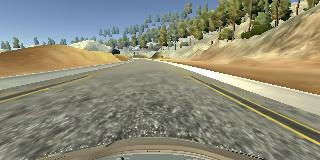

# **Behavioural Cloning**

---

The goals / steps of this project are the following:
  
* Use the simulator to collect data of good driving behavior  
* Build, a convolution neural network in Keras that predicts steering angles from images  
* Train and validate the model with a training and validation set  
* Test that the model successfully drives around track one without leaving the road  
* Summarize the results with a written report  


## Rubric Points
Here I will consider the [rubric points](https://review.udacity.com/#!/rubrics/432/view) individually and describe how I addressed each point in my implementation.  

---
### Files Submitted & Code Quality

#### 1. Submission includes all required files and can be used to run the simulator in autonomous mode

My project includes the following files:
* Project-3-Behavioural-Cloning.ipynb containing the script to create and train the model
* drive.py for driving the car in autonomous mode
* model.h5 containing a trained convolution neural network
* writeup_report.md or writeup_report.pdf summarizing the results

#### 2. Submission includes functional code
Using the Udacity provided simulator and my drive.py file, the car can be driven autonomously around the track by executing
```sh
python drive.py model.h5
```

#### 3. Submission code is usable and readable

The model.py file contains the code for training and saving the convolution neural network. The file shows the pipeline I used for training and validating the model, and it contains comments to explain how the code works.

### Model Architecture and Training Strategy

#### 1. An appropriate model architecture has been employed

My model consists of a convolution neural network with 3x3 filter sizes and depths between 24 and 64 (Project-3-Behavioural-Cloning.ipynb code block 19)

The model includes RELU layers to introduce nonlinearity, and the data is normalized in the model using a Keras lambda layer.

#### 2. Attempts to reduce overfitting in the model

The model contains dropout layers in order to reduce overfitting.

The model was trained and validated on different data sets to ensure that the model was not overfitting (80%-20% split). The model was tested by running it through the simulator and ensuring that the vehicle could stay on the track.

#### 3. Model parameter tuning

The model used an adam optimizer, so the learning rate was not tuned manually.

#### 4. Appropriate training data

Training data was chosen to keep the vehicle driving on the road. I used a combination of center lane driving, recovering from the left and right sides of the road and track two laps.

For details about how I created the training data, see the next section.

### Model Architecture and Training Strategy

#### 1. Solution Design Approach

The overall strategy for deriving a model architecture was to use a simple 3 layer CNN to get a baseline for performance. Then to use NVIDIA's 5 layer CNN with 4 fully connnected layers to determine the steering angle.

My first step was to use a convolution neural network model similar to the LeNet architecture I thought this model might be appropriate because LeNet has good convergence properties for image classification.

In order to gauge how well the model was working, I split my image and steering angle data into a training and validation set. I found that my first model had a low mean squared error on the training set but a high mean squared error on the validation set. This implied that the model was overfitting.

To combat the overfitting, I modified the model so that it used a dropout after each convolution, with a dropout rate of 0.30.

Then I modified the strides to be (2,2) to allow the network to train more quickly and reduce overfitting.

Also, I changed the first convolutional layer to have a filter dimension of (5,5) to capture larger features in the images.

The final step was to run the simulator to see how well the car was driving around track one. There were a few spots where the vehicle fell off the track these included the corners with red/white striped borders and at the bridge. To improve the driving behavior in these cases, I recorded more training data in the simulator and retrained the model.

At the end of the process, the vehicle is able to drive autonomously around the track without leaving the road.

#### 2. Final Model Architecture

The final model architecture consisted of a convolution neural network with the layers and layer sizes in the table below.


| Layer Type | Properties |  
|-----------|---|
| Lambda Normalisation Layer | NA |
| Cropping Layer | 90x320 |
| Conv1 | Filters=24, Size=(5,5), Strides=(2,2), Padding=Same, Activation=Relu|
| Maxpooling | Size=(2,2) |
| Dropout | drop rate = 0.3 |
| Conv2 | Filters=36, Size=(3,3), Strides=(2,2), Padding=Same, Activation=Relu|
| Maxpooling | Size=(2,2) |
| Dropout | drop rate = 0.3 |
| Conv3 | Filters=48, Size=(3,3), Strides=(1,1), Padding=Same, Activation=Relu|
| Maxpooling | Size=(2,2) |
| Dropout | drop rate = 0.3 |
| Conv4 | Filters=64, Size=(3,3), Strides=(1,1), Padding=Same, Activation=Relu|
| Maxpooling | Size=(2,2) |
| Dropout | drop rate = 0.3 |
|Flatten| NA |
| Fully Connected| Dim=1024, Activation=Relu|
| Fully Connected| Dim=100, Activation=Relu||
| Fully Connected| Dim=50, Activation=Relu||
| Fully Connected| Dim=10, Activation=Relu||
| Fully Connected| Dim=1, Activation=Linear|


#### 3. Creation of the Training Set & Training Process

To capture good driving behavior, I first recorded two laps on track one using center lane driving. Here is an example image of center lane driving:

<p align="center">
  
</p>

I then recorded the vehicle recovering from the left side and right sides of the road back to center so that the vehicle would learn to bring itself back onto the road if it veered off the side. These images show what a recovery looks like starting from driving off the road:

<p align="center">
  
</p>
<p align="center">
  
</p>
<p align="center">
  
</p>

Then I repeated this process on track two in order to get more data points.

To augment the data set, I also flipped images and angles thinking that this would help to reduce a bias for turning one direction in the model. For example, here is an image that has then been flipped:

<p align="center">
  
</p>
<p align="center">
  
</p>

After the collection process, I had 13,886 number of data points. I then doubled this through flipping and then preprocessed this data by adding in the left and right hand side cameras with a steering offset to give the model more data. This resulted in 83,316 data points.

I finally randomly shuffled the data set and put 20% of the data into a validation set.

I used this training data for training the model. The validation set helped determine if the model was over or under fitting. The ideal number of epochs was 10 as evidenced by the diminishing returns of additional training epochs on reducing the validation MSE in the figure below. I used an adam optimizer so that manually training the learning rate wasn't necessary.

<p align="center">
  
</p>
